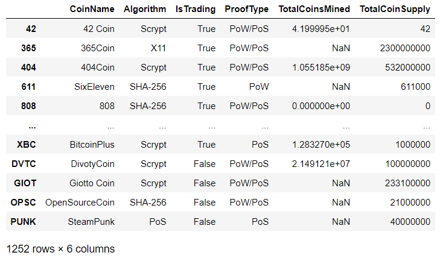
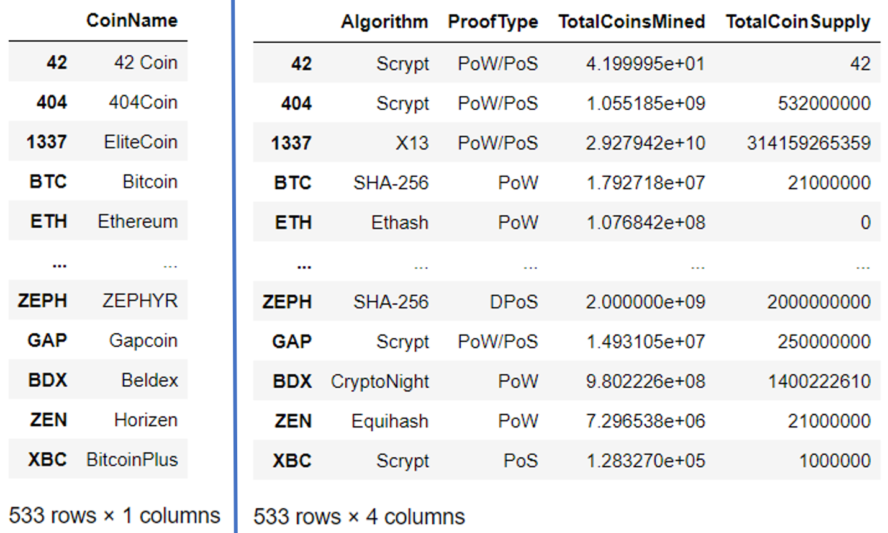
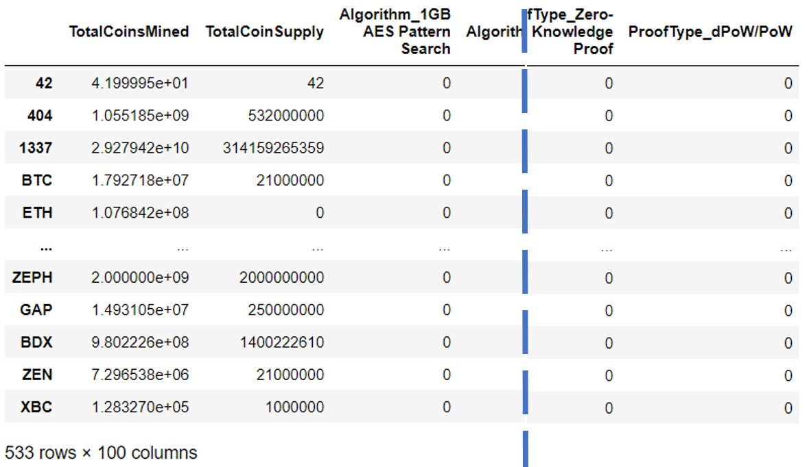
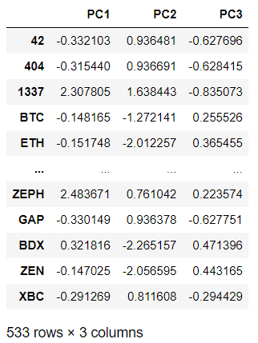
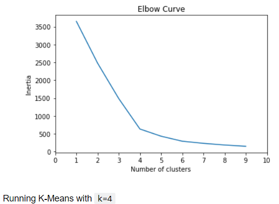
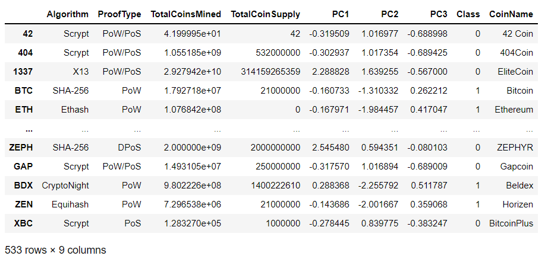
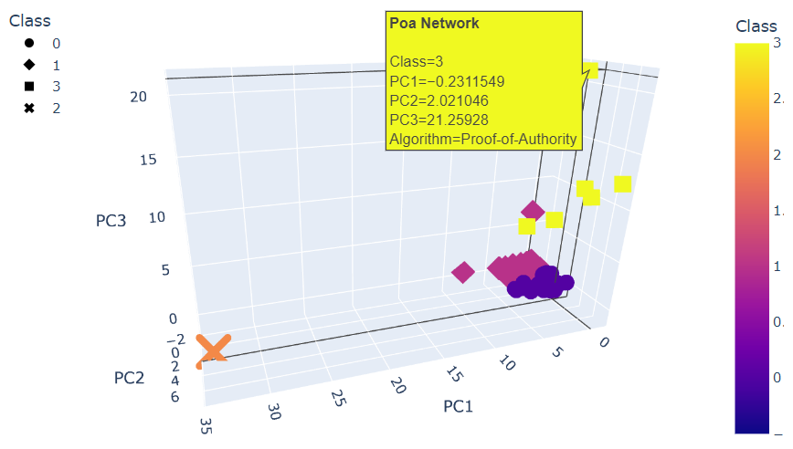
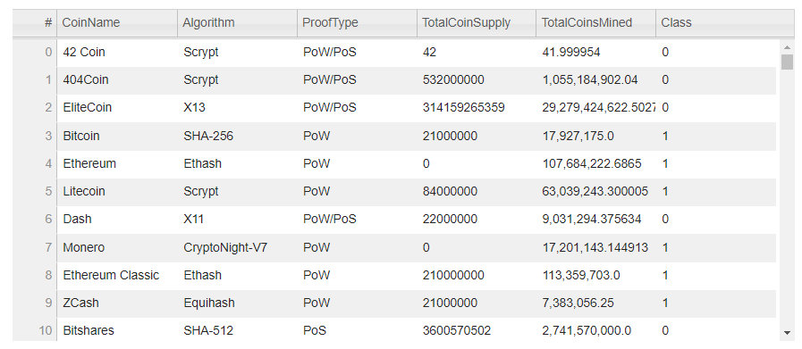
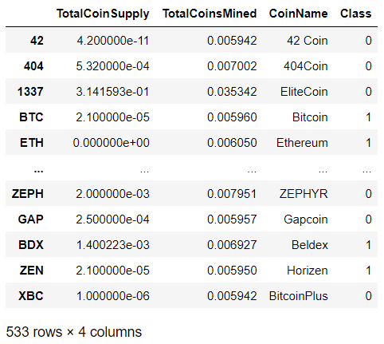
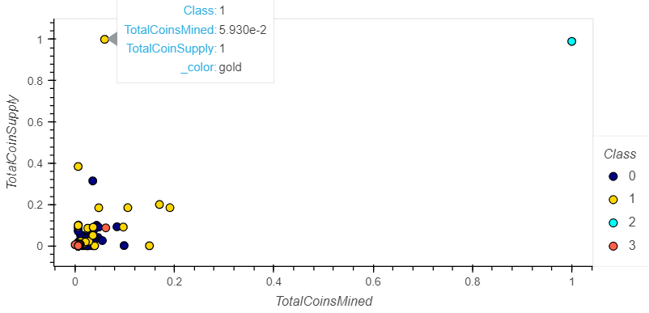

Unsupervised learning is the best way forward for your dataset because you are looking for any groupings, trends, or other information that could help pitch cryptocurrencies to the firm.

Create an analysis for your clients who are preparing to get into the cryptocurrency market.

The bank is interested in offering a new cryptocurrency investment portfolio for its customers. However, is lost in the vast universe of cryptocurrencies. So, they’ve asked for a report that includes what cryptocurrencies are on the trading market and how they could be grouped to create a classification system for this new investment.

The data is not ideal, so it will need to be processed to fit the machine learning models. Since there is no known output (what we're looking for), use unsupervised learning. Group the cryptocurrencies using a clustering algorithm. Create data visualizations to share findings with the board.

[Crypto Data](crypto_data.csv)

[Python Code](crypto_clustering.ipynb)

## Step 1: Preprocessing the Data for PCA

## Step 2: Reducing Data Dimensions Using PCA & put into new dataframe

## Step 3: Clustering Cryptocurrencies Using K-means

## Step 4: Visualizing Cryptocurrencies Results

